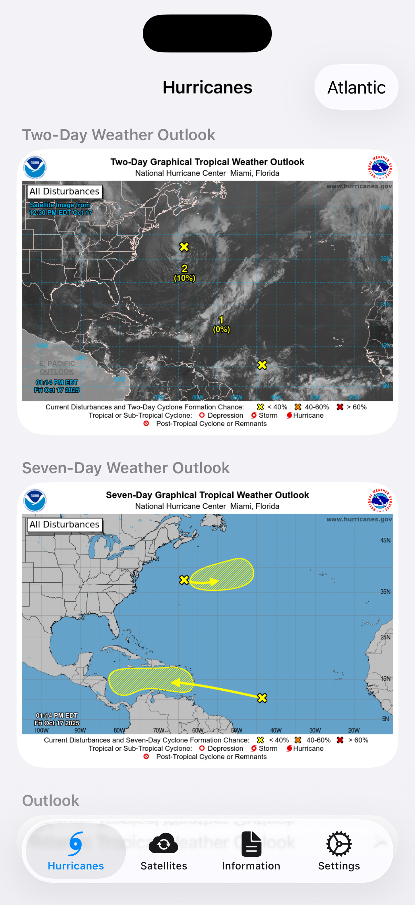
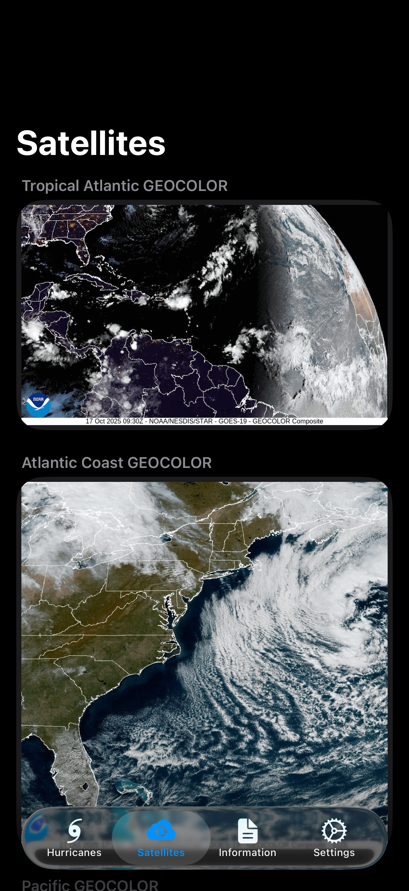

# Hurricanes

## Information
- SwiftUI app for displaying information about hurricanes from NOAA and the National Hurricane Center (NHC).
- Displays graphic from the NHC such as a 3-day and 7-day outlook.
- Information tab for displaying videos and information on hurricanes and how they are categorized.

## Preview

## Usage
Open the project in Xcode and run with either a Simulator instance or a physical device with Developer Mode enabled as a destination.
